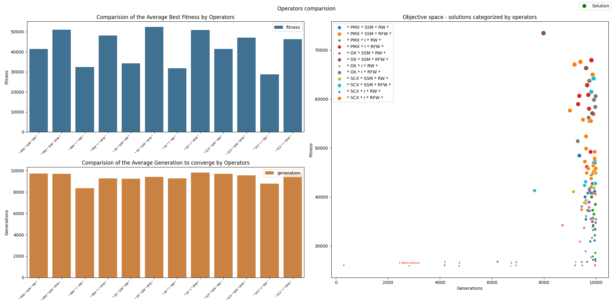
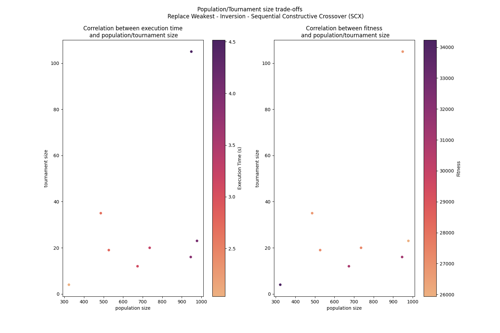

# Evolutionary Algorithm: The Travelling Salesman Problem (TSP)

**Please visit [Github repository](https://github.com/dathd6/Evolutionary_Algorithm_TSP) to see the README.md in better format**

## Disclaimer
- There are some constant variables in file `constants.py` that you can tune to make perfect for you, whether the population and tournament size range is too big or small. Moreover, the dataset names and directories may differ from what I have.
- In the README.md test run tutorial, you may not get the best fitness every single time. If you are getting stuck at local optima, it is better to run multiple experiments to explore the landscape or delete/back up the reports folder and then run another test.

## About the code

- Programming language: Python
- Version: 3.11.5

## Dependencies:
- [matplotlib](https://matplotlib.org)
- [seaborn](https://seaborn.pydata.org/)

## File structure:

- main.py: contained the main code to execute N experiments on finding the best fitness
- constant.py: constant variables
- utils.py: utility functions (find the best fitness, swap gene in chromosome, visualize data)
- experimentation.py: Experimentation class
    + choose the population/tournament size, crossover/mutation/replacement function (random)
    + Initialize EA and execute the tournament selection/crossover/mutation/replacement through 10,000 generations
    + Generate detail process report
    + Generate image visualise solution's route, convergence curves and execution time, comparision graph between different parameters
- evolutionary_algorithm.py: EA class
    + Extract data from XML file
    + Generate population of N random solutions
    + Method of replacement function, tournament selection
    + Method of find the best fitness
- tsp.py: TSP solution class
    + Attribute: fitness and route
    + Method of calculate fitness from route
    + Method of crossover
        - Sequential Constructive Crossover
        - Ordered Crossover
        - Partially Mapped Crossover
    + Method of Mutation
        - Single Swap Mutation
        - Multiple Swap Mutation
        - Inversion
- requirements: requirement's packages/libraries
- README.md: Documentation for the code
- datasets/: Folder (datasets) contains data of the map (vertices, edges, cost)
    + brazil58.xml
    + burma14.xml
- reports.sample/: Sample result of EA. The best fitness is presented in this sample report.

## Pre-execution

- [Install Latest version of Python3](https://www.python.org/downloads/)

- [Install virtualenv](https://virtualenv.pypa.io/en/latest/installation.html)

Open terminal and `cd` to the code directory then create virtual environment
```bash
virtualenv env
```

Activate virtual environment
```bash
source env/bin/activate
```
 
Install dependencies
```bash
pip install -r requirements.txt
```

(OPTIONAL) Printout help option
```bash
python3 main.py --help
```
```bash
usage: main.py [-h] [--data DATA] [--experimentation EXPERIMENTATION] [--exploit]

Evolutionary Algorithm: The Travelling Salesman Problem

options:
  -h, --help            show this help message and exit
  --data DATA, -d DATA  Path to dataset file
  --experimentation EXPERIMENTATION, -e EXPERIMENTATION
                        Number of experimentation
  --exploit, -ex        Exploit EA by utilizing recorded solution
```

Execute command (change option according to objective - exploration or exploitation)
DEFAULT: 
- data = burma14.xml
- experimentation = 1
- exploit = FALSE
```bash
python3 main.py
python3 main.py --data datasets/burma14.xml --experimentation 3
python3 main.py -d datasets/brazil58.xml -e 3
python3 main.py -d datasets/brazil58.xml -e 10 --exploit
```
Result:
```bash
Experimentation 92
- Population size: 3607
- Tournament size: 240
- Crossover function: ordered_crossover
- Mutation function: inversion
- Replacement function: replace_first_weakest
--> Best solution: 28557.0
--> Route: [54, 47, 40, 46, 20, 28, 35, 18, 5, 13, 36, 14, 33, 45, 55, 44, 32, 27, 16, 25, 51, 50, 2, 9, 34, 48, 42, 22, 56, 11, 26, 4, 57, 23, 43, 17, 0, 8, 12, 39, 29, 24, 31, 19, 52, 49, 3, 7, 21, 15, 30, 6, 41, 37, 10, 38, 1, 53]
--> Get the best fitness at generation: 9674 of 10000
```

## Execution

I separate the execution into two part: Exploration and Execution

### Exploration

#### Burma14

For this problem, it is easy to get to the best fitness, so we only run around 10 experiments.
```bash
python3 main.py -d datasets/burma14.xml -e 10
```

#### Brazil58
Run 100 experiments to explore the landscape
```bash
python3 main.py -d datasets/brazil58.xml -e 100
```

### Execution
Run 10 experiments to exploit the fittest around 5 times to get the best fitness (not guarantee)
```bash
python3 main.py -d datasets/brazil58.xml -e 10 --exploit
```

## View Results
**In this example: I only show Brazil problem**
Check the report [report_brazil58.csv](./reports.sample/report_brazil58.csv) to see the best fitness that you could have.


Check the Summary Visual to get the overview best fitness and execution time of each run


Check the comparision between operators



Check the comparision between population and tournament size



In this run, I got the best fitness in the report number 202. So I view the route and execution time in the detail `report_202.png` image.


## Report structure
```md
reports
├── report_COUNTRY: Contains N experiment reports (PNG)
│   ├── report_1.png
│   ├── report_2.png
│   .
│   .
│   └── report_N.png: Image of solution's route, convergence curves, parameters and execution time
├── summary_graph_COUNTRY.png: Summary line plot of execution time and best fitness in each experiment
├── population_and_tournament_size_comparision_COUNTRY.png: Scatter Plot compare execution time/fitness when running EA with different tournament and population size 
├── operators_comparision_COUNTRY.png: Bar plot compare the average fitness and execution time of all experiments categorized by operators (Crossover/Mutation/Replacement)
└── report_COUNTRY.csv: Summary and recorded report of the best fitness from every experiments that we have run (Could reuse to exploit the landscape).
```
